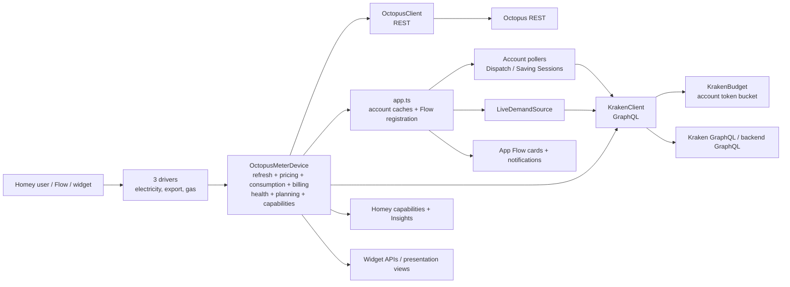
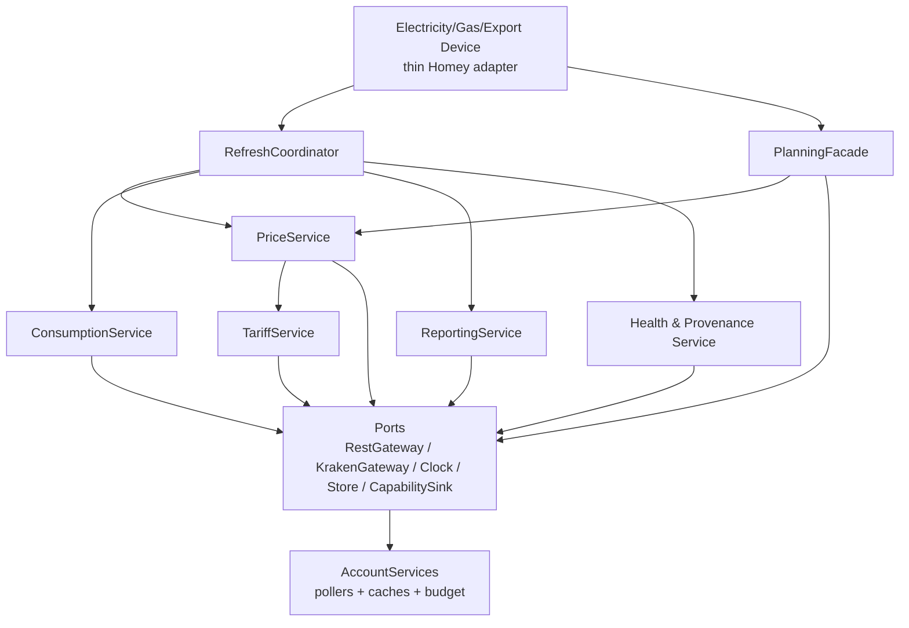

# 04 — Architecture Review

**Review date:** 21 July 2026  
**Scope:** current `main`, Homey SDK v3, docs-only assessment

## Executive assessment

The app has evolved from a conventional driver/client design into a capable local
energy platform. Its strongest architectural decisions are: a typed REST boundary,
an account-scoped Kraken budget, fail-closed GraphQL parsing, account-level pollers,
pure dispatch/billing/planning modules, and explicit provenance. Its principal
structural weakness is that `OctopusMeterDevice` remains the composition root,
scheduler, cache consumer, domain service, reporting engine, health manager and
Homey adapter for most meter behaviour (`lib/OctopusMeterDevice.ts:155-2392`).

The target state should **not** be a rewrite. It should complete planned Sprint 52:
retain Homey device subclasses and public IDs while extracting cohesive, typed
services behind a thin device façade. This agrees with
`docs/handover/sprints-50-58-spec.md` S52 and extends it with explicit ownership,
ports and migration gates.

## Current component and data flow

Evidence: the generated manifest declares SDK v3, local-only operation and three
sensor drivers (`app.json:3-10`, `app.json:3120-3200`,
`app.json:3365-3439`, `app.json:3480-3544`). `app.ts` owns shared clients,
caches and pollers (`app.ts:28-325`, `app.ts:327-424`). The device base explicitly
states that it owns API clients, refresh scheduling and common price, standing
charge and balance logic (`lib/OctopusMeterDevice.ts:155-158`).

## Layering and boundaries

### Presentation / Homey adapter layer

- Drivers own pairing and identity-safe repair; credentials are validated before
  pairing, and repair must rediscover the original MPAN/MPRN plus serial
  (`lib/OctopusMeterDriver.ts:20-24`, `lib/OctopusMeterDriver.ts:93-143`,
  `lib/OctopusMeterDriver.ts:145-179`).
- Capabilities, Flow cards, notifications and widget APIs form the Homey-facing
  contract. Existing IDs must remain stable, as required by
  `docs/handover/sprints-50-58-spec.md` REQ-001.
- Widgets are appropriate for this local-only app: Homey widgets require
  compatibility `>=12.3.0` and do not run on Homey Cloud; the app targets
  `>=12.4.0` and `platforms: ["local"]`
  ([Homey widgets](https://apps.developer.homey.app/the-basics/widgets),
  `app.json:5-10`).

### Application orchestration layer

- `app.ts` is the account-scoped composition root. It reuses one Kraken client per
  account/API-key pair and invalidates account caches when credentials change
  (`app.ts:68-125`).
- Account caches use TTL plus in-flight deduplication for balance, planned and
  completed dispatches, linked devices, device-scoped plans and IOG tariff data
  (`app.ts:127-325`). This is a sound application-service boundary, although the
  number of parallel maps makes policy difficult to audit.
- `AccountPoller` deduplicates credentials by account across devices
  (`lib/AccountPoller.ts:63-81`). `DispatchPoller` uses a reconciled account view
  and persists identifier-free aggregate diagnostics
  (`lib/DispatchPoller.ts:39-83`, `lib/DispatchPoller.ts:205-227`).

### Domain layer

The best-isolated code is pure:

- Dispatch normalisation and reconciliation fail closed, use absolute instants for
  DST correctness, and never infer cancellation from a failed poll
  (`lib/dispatch/deviceModel.ts:5-53`, `lib/dispatch/reconcile.ts:5-13`,
  `lib/dispatch/reconcile.ts:67-152`).
- Dispatch types encode intent-versus-settlement boundaries and strip device IDs
  from presentation views (`lib/dispatch/types.ts:3-34`,
  `lib/dispatch/types.ts:63-84`).
- Billing, price analytics, planner and effective-rate calculations are already
  moving toward pure modules, as recorded in `ROADMAP.md` S44-S47 and
  `docs/handover/sprints-50-58-spec.md` S52.

### Integration layer

- `OctopusClient` is a thin typed REST adapter with HTTPS/origin enforcement,
  manual redirect rejection, timeouts, bounded retry and guarded pagination
  (`lib/OctopusClient.ts:107-140`, `lib/OctopusClient.ts:142-238`,
  `lib/OctopusClient.ts:240-272`).
- `KrakenClient` is the GraphQL adapter and the sole budgeted network choke point.
  Tokens are memory-only and single-flighted (`lib/KrakenClient.ts:118-132`,
  `lib/KrakenClient.ts:238-269`).
- `KrakenBudget` keeps process-wide, account-keyed buckets because callers may
  construct multiple client instances (`lib/KrakenBudget.ts:12-18`,
  `lib/KrakenBudget.ts:135-168`).

## The `OctopusMeterDevice` god-object

The file contains more than 120 methods and owns:

- lifecycle/client construction (`lib/OctopusMeterDevice.ts:230-294`);
- repair coordination and credential replacement
  (`lib/OctopusMeterDevice.ts:442-503`);
- refresh locking, parallel fetches and reporting sequencing
  (`lib/OctopusMeterDevice.ts:520-591`);
- diagnostics/redaction (`lib/OctopusMeterDevice.ts:606-669`);
- tariff recovery and health (`lib/OctopusMeterDevice.ts:670-807`);
- consumption/cumulative-meter mutation (`lib/OctopusMeterDevice.ts:818-922`);
- pricing, IOG recovery and provenance (`lib/OctopusMeterDevice.ts:967-1297`);
- planning, carbon weighting and tariff comparison
  (`lib/OctopusMeterDevice.ts:1310-1881`);
- time-zone calculations and billing (`lib/OctopusMeterDevice.ts:1882-2213`);
- balance, points, Flow triggers and scheduling
  (`lib/OctopusMeterDevice.ts:2214-2392`).

This concentration raises four risks:

1. **Change amplification:** adding a price, billing or provenance feature changes
   the same class and often the same refresh transaction.
2. **Implicit ordering:** price/standing/balance run in parallel, then meter data,
   then reporting (`lib/OctopusMeterDevice.ts:546-581`). Correctness depends on
   ordering that is not represented as a typed dependency graph.
3. **Mixed authority:** REST-settled, GraphQL-operational and app-estimated values
   coexist in one mutable object; F1 reduces presentation risk but does not enforce
   source authority structurally.
4. **Testing friction:** pure algorithms are testable, but orchestration still
   requires partial device prototypes/mocks. S52 characterization tests are
   therefore essential, not optional.

⚠ **Cross-discipline note:** product reviewers may prefer feature delivery before
refactoring. Architecture recommends the opposite for S52 only: freeze behaviour,
extract seams, then resume S53-S58. A broad rewrite or new UX during S52 would be
counterproductive.

## Concurrency and threading model

Homey/Node executes app callbacks on one event loop; concurrency comes from
interleaved promises and timers, not shared-memory threads.

- Device refresh is single-flighted with a 90-second stuck-lock watchdog
  (`lib/OctopusMeterDevice.ts:520-542`).
- Independent price, standing charge and balance reads run concurrently; meter
  data and reporting then run sequentially (`lib/OctopusMeterDevice.ts:546-581`).
- The watchdog can abandon the lock without cancelling the original work. The
  generation check prevents the old promise clearing a newer lock, but both
  generations can still issue network calls and mutate capabilities/store. This
  concern is already recorded in the S50-S58 risk section.
- Pollers parallelise accounts (`lib/DispatchPoller.ts:86-96`) while serialising
  state within an account. Live demand is one subscription-driven, single-flight
  loop per account (`lib/LiveDemandSource.ts:10-17`,
  `lib/LiveDemandSource.ts:78-115`, `lib/LiveDemandSource.ts:147-197`).
- Timers are Homey-managed and cleared on deletion/uninit
  (`lib/OctopusMeterDevice.ts:2307-2392`).

Recommendation: replace the watchdog “lock reset” with a refresh generation plus
`AbortSignal` propagated to integration calls, or let the prior generation finish
while rejecting a new refresh. Do not permit two writers for cumulative cursor/store
state.

## Caching

### Strengths

- Most app caches have explicit TTLs and in-flight maps (`app.ts:127-325`).
- The IOG cache uses longer success TTL and exponential null backoff to reduce
  repeated core-budget spend (`app.ts:253-306`).
- Octoplus session caching now expires and never memoises rejection
  (`lib/KrakenClient.ts:708-729`).
- REST pagination and rate rows remain source data rather than long-lived derived
  state (`lib/OctopusClient.ts:240-272`, `lib/OctopusClient.ts:393-482`).

### Weaknesses

- Cache policy is distributed across `app.ts`, clients and device fields.
- Account-number strings are cache keys. They are not logged, but
  `docs/handover/sprints-50-58-spec.md` REQ-005 asks for opaque/salted persisted
  keys; transient in-memory keys should still be documented as an intentional
  exception.
- Duplicate REST reads remain (S51e), especially monthly/billing consumption,
  carbon and product catalogue requests.

Target: one typed `AccountDataCache` with named entries, TTL, source timestamp,
single-flight and invalidation reason. Avoid a generic “cache everything” layer.

## Resilience and backoff

- REST: 20-second timeout, three attempts, bounded `Retry-After`/exponential retry,
  redacted errors, same-origin pagination and a 50-page cap
  (`lib/OctopusClient.ts:125-139`, `lib/OctopusClient.ts:184-272`).
- GraphQL: timeout, transient retry, token refresh once after auth failure, no
  inline retry after 429, and budget skips preserve the last known value
  (`lib/KrakenClient.ts:145-233`).
- Dispatch reconciliation retains prior planned state on failed acquisition,
  avoiding fabricated cancellation/ended edges
  (`lib/dispatch/reconcile.ts:79-83`, `lib/dispatch/reconcile.ts:121-124`).
- Health distinguishes a price-only advisory from total connectivity/auth failure
  (`lib/OctopusMeterDevice.ts:767-805`).

Residual concern: GraphQL application errors arrive with HTTP 200 per current
official guidance, so monitoring must classify `errors[].extensions.errorCode`,
not only HTTP status
([GraphQL basics](https://docs.octopus.energy/graphql/guides/basics/)).

## Shared-budget design (F0)

F0 is architecturally correct: a process-module registry provides one bucket per
account; every GraphQL call is admitted at `KrakenClient.post()`
(`lib/KrakenBudget.ts:12-18`, `lib/KrakenClient.ts:145-180`). The sustained target
is 90 requests/hour with burst capacity six, priority classes and an exponential
429 gate (`lib/KrakenBudget.ts:17-18`, `lib/KrakenBudget.ts:46-55`,
`lib/KrakenBudget.ts:89-127`).

However, official current docs describe **complexity/points**, not a universal
request count: complexity is capped at 200/request; default account-user allowance
is 50,000 points/hour; field-specific limits can also apply
([GraphQL usage constraints](https://docs.octopus.energy/graphql/guides/basics/)).
The repo's ~100-125 requests/hour constraint is therefore best treated as an
empirical operational ceiling for these account fields, not the upstream quota
contract.

Recommendation:

1. retain the conservative 90 request/hour governor;
2. add `rateLimitInfo` sampling at very low cadence if permission and budget allow;
3. record admitted/denied calls by priority/feature without identifiers (S51d);
4. add startup jitter (S51c);
5. complete the one-hour two-EV system simulation (S51h).

## Provenance and freshness (F1)

`Reading<T>` encodes value, source timestamp, REST/GraphQL/cache source and only
three freshness states: current, stale, unknown
(`lib/freshness.ts:3-27`). Staleness tolerates two missed refresh cycles and retains
the last value (`lib/freshness.ts:43-58`). Planned, completed/finalised and estimated
are separate presentation provenance concepts in the dispatch/effective-rate
models, which is the right separation.

Current limitation: device-level `getDataFreshness()` is still an aggregate
summary, while prices, balance, carbon, live demand, dispatch and billing have
different clocks (`lib/OctopusMeterDevice.ts:315-334`). This is exactly why S53's
per-source freshness should follow S52.

## Target-state architecture

### Proposed responsibilities

| Component | Owns | Must not own |
|---|---|---|
| `OctopusMeterDevice` façade | lifecycle, capability wiring, delegation | pricing/billing algorithms, direct fetches |
| `RefreshCoordinator` | generation, cancellation, dependency DAG, result summary | domain calculations |
| `PriceService` | rate acquisition, current slot, price capabilities | account balance, timers |
| `TariffService` | discovery, active tariff, IOG adoption/recovery | Homey UI |
| `ConsumptionService` | cursor-safe consumption and cumulative meter | price planning |
| `ReportingService` | today/month/billing aggregates | source transport |
| `HealthProvenanceService` | per-domain readings, warnings, diagnostics | upstream fetch details |
| `PlanningFacade` | cheapest/peak/charge/tariff comparison adapters | direct capability mutation |
| `AccountServices` | per-account clients, caches, pollers, Kraken budget | per-device identity |

Define ports for `Clock`, `Scheduler`, `MeterStore`, `CapabilitySink`,
`NotificationSink`, `RestGateway` and `KrakenGateway`. This permits deterministic
tests without emulating a full Homey device.

## Migration path

1. **Baseline (S51 remainder):** finish budget diagnostics, startup jitter, REST
   coalescing, points cache and sibling credential propagation. Do not refactor a
   moving budget/credential boundary.
2. **Characterise:** lock current refresh ordering, capability outputs, cursor
   writes, error classifications, timer cadence and repair rollback in tests.
3. **Introduce typed ports:** add `OctopusApp`, `MeterStorePort`, clock and sinks;
   keep all implementation in the existing class initially.
4. **Extract leaf services first:** timezone/masking, health/provenance and tariff
   helpers, then planning façade. These have few write-side dependencies.
5. **Extract reporting and consumption:** preserve one writer for cumulative
   state; coalesce shared REST reads.
6. **Extract price/tariff orchestration:** move IOG recovery last because it crosses
   REST authority, GraphQL contract and repair/cache invalidation.
7. **Replace refresh lock:** coordinator owns one generation and cancellation.
8. **S53 rollout:** only after behavioural parity, expose per-domain freshness and
   accessibility changes.

Every step should preserve capability/Flow/widget IDs and app version, matching
S52's zero-behaviour-change rule.

## Strengths, weaknesses and priority risks

| Area | Assessment |
|---|---|
| API boundaries | Strong typed adapters; GraphQL client still large |
| Domain purity | Strong and improving in dispatch/billing/planning |
| Homey integration | Broad, stable ID surface; device base overly central |
| Concurrency | Good single-flight intent; watchdog permits overlapping writers |
| Caching | TTL/inflight discipline is strong; policy is fragmented |
| Resilience | Strong REST hardening and fail-closed GraphQL |
| Budget | Correct shared choke point; needs official points-aware telemetry |
| Provenance | Excellent principle; aggregate device freshness is too coarse |
| Evolvability | Constrained by the god-object until S52 completes |

**Architectural recommendation:** agree with the existing S50-S58 order. Complete
S51, deliver a strictly behavioural S52 decomposition, then implement S53-S58 on
the extracted services. Diverge only by adding cancellation/generation safety and
explicit ports to S52 acceptance criteria.
