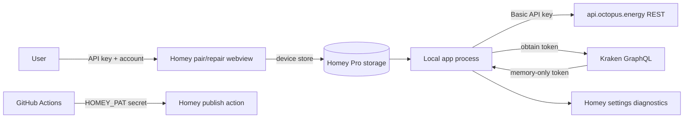

# 06 — Security Review

**Review date:** 21 July 2026  
**Method:** repository threat model and control review; no penetration testing

## Executive assessment

No critical vulnerability was identified in the reviewed design. The app has
strong transport hardening, memory-only Kraken tokens, immutable CI action pins,
synthetic contract fixtures, redacted diagnostics and no runtime dependency
surface. The highest residual risks are credential duplication across device
stores, stale sibling credentials after repair, identifier-bearing internal keys,
GraphQL schema/authorization drift, and release-token exposure if workflow
boundaries regress.

This assessment complements, but does not replace, the independent security
specialist review.

## Assets and trust boundaries

### Sensitive assets

- Octopus REST API key.
- Octopus account number.
- MPAN/MPRN and meter serial.
- Kraken access token.
- Home Mini/smart-flex device IDs.
- Consumption, balance, dispatch and billing data.
- GitHub `HOMEY_PAT` used to publish Homey builds.

### Boundaries

The app is local-only (`app.json:5-10`) but remains a cloud-account integration;
local execution does not remove upstream credential and privacy threats.

## Threat model

| Threat | Relevant controls | Residual concern |
|---|---|---|
| Credential theft from storage | Device Store is the documented Homey backend-persistent mechanism; no credentials in app settings/userdata ([Homey persistent storage](https://apps.developer.homey.app/the-basics/app/persistent-storage), `lib/OctopusMeterDriver.ts:71-85`) | API key/account duplicated on every meter device |
| Token theft | Kraken token only in instance memory (`lib/KrakenClient.ts:118-132`) | Crash dump/runtime compromise remains out of app control |
| Credential exfiltration by redirect/SSRF | HTTPS, no URL credentials, same-origin enforcement, manual redirects (`lib/OctopusClient.ts:125-181`) | GraphQL custom URL injection must remain test-only |
| Log/diagnostic leakage | Redaction helpers and identifier-free aggregates (`lib/OctopusMeterDevice.ts:606-669`, `lib/DispatchPoller.ts:205-227`) | Some settings/state are still keyed by account number |
| Malicious upstream strings / XSS | Widget escaping and DOM-safe settings documented in `HANDOVER.md` Sprint 49 | Every new widget/settings field must use text/escaping |
| GraphQL injection | Queries are static documents with variables, not string interpolation (`lib/KrakenClient.ts:247-269` and operation methods) | Avoid future dynamic fragment/field composition |
| Pair-session cross-user/state bleed | Pair state is session-local (`lib/OctopusMeterDriver.ts:93-143`) | Custom HTML remains an input boundary |
| Supply-chain compromise | Zero runtime dependencies; SHA-pinned Actions; `npm audit` gates | Dev dependency and action-runtime updates still carry risk |
| Publish credential theft | `HOMEY_PAT` only referenced through GitHub secret and publish workflow has `contents: read` (`.github/workflows/homey-app-publish.yml:3-15`, `:45-49`) | Manual dispatch can publish any selected ref allowed by workflow policy |

## Credential and token handling

### API key and account storage

Pairing stores API key, account number, MPAN/MPRN, serial and tariff metadata in
the Homey Device Store (`lib/OctopusMeterDriver.ts:71-85`). Homey documents the
Device Store as the appropriate backend persistent store for per-device data
([Homey persistent storage](https://apps.developer.homey.app/the-basics/app/persistent-storage)).

This is reasonable, but the same account credential is duplicated across
electricity, export and gas devices. Risks:

- repair of one device can leave siblings with an old key;
- deletion/backup scope is per device rather than per account;
- more persisted copies increase exposure.

S51g's account-wide repair propagation is therefore a security and reliability
requirement, not merely an optimisation
(`docs/handover/sprints-50-58-spec.md` TASK-051g).

Longer term, prefer one account credential record referenced by opaque account ID,
if Homey's storage and migration model permit it. Do not move secrets into
`/userdata`; Homey warns that userdata is web-accessible
([Homey persistent storage](https://apps.developer.homey.app/the-basics/app/persistent-storage)).

### Kraken tokens

The token, expiry and in-flight promise are private in-memory fields
(`lib/KrakenClient.ts:118-132`). `getToken` is single-flighted and rejected fetches
are cleared (`lib/KrakenClient.ts:238-269`). Authenticated query failure clears the
token and retries once (`lib/KrakenClient.ts:212-229`). No token persistence was
found.

**Finding S-LOW-01:** fixed local expiry assumptions may refresh too early/late if
upstream token lifetime changes.  
**Remediation:** where safely parseable, use token `exp` with skew; continue to
honour upstream auth failure and never log token content.

## Transport security

REST controls are strong:

- HTTPS enforced (`lib/OctopusClient.ts:125-136`);
- redirect following disabled (`lib/OctopusClient.ts:147-156`);
- credentials cannot cross origin (`lib/OctopusClient.ts:167-181`);
- response bodies are not echoed in errors (`lib/OctopusClient.ts:197-228`);
- timeouts prevent permanent refresh lock (`lib/OctopusClient.ts:142-160`).

GraphQL endpoints are HTTPS constants (`lib/KrakenClient.ts:21-23`), and official
guidance requires HTTPS
([GraphQL basics](https://docs.octopus.energy/graphql/guides/basics/)).

**Finding S-MED-01:** GraphQL constructor accepts alternate URLs for tests
(`lib/KrakenClient.ts:134-143`). If that configurability ever becomes user- or
settings-controlled, it would create a credential-exfiltration boundary.  
**Remediation:** keep alternate endpoint injection test-only; production must
allow-list exact HTTPS origins and reject redirects.

## Injection and prompt surfaces

This is not an LLM application, so prompt injection is not a runtime threat. The
relevant injection surfaces are:

- custom pairing/repair HTML receiving API key, account and optional manual meter
  identity;
- upstream product/event text rendered in widgets/settings;
- Flow token text and notification excerpts;
- GraphQL/REST variables.

Controls:

- account, MPAN/MPRN, serial and tariff formats are validated
  (`lib/OctopusMeterDriver.ts:30-38`, `lib/OctopusMeterDriver.ts:104-131`);
- GraphQL uses variables rather than query interpolation;
- Sprint 49 tests widget escaping and removed dynamic `innerHTML` from billing
  settings (`HANDOVER.md`, “Sprint 49 Trust & Polish”);
- notification content is generated from app-normalised fields
  (`lib/AccountPoller.ts:91-108`).

**Finding S-MED-02:** custom webviews are an ongoing XSS boundary, especially when
adding tariff names, event descriptions or API error text.  
**Remediation:** require `textContent` or one shared escaping helper; forbid
rendering raw upstream bodies; include malicious-string cases in every widget and
settings test.

⚠ **Cross-discipline note:** product may request richer upstream event copy.
Security recommends a curated field allow-list and localised templates instead of
displaying arbitrary GraphQL description/HTML.

## Logging, redaction, fixtures and diagnostics

### Verified controls

- Integration diagnostics redact API key, account, MPAN/MPRN, serial and Homey
  device ID before persistence (`lib/OctopusMeterDevice.ts:606-669`).
- A regression test injects all identifiers into an error and asserts that only
  `[redacted]` persists (`test/health.test.js:192-216`).
- Dispatch presentation removes smart-flex device IDs
  (`lib/dispatch/types.ts:63-84`); diagnostics are aggregate and identifier-free
  (`lib/DispatchPoller.ts:205-227`).
- Kraken fixtures are required to be synthetic and identifier-free by the contract
  record (`docs/research/kraken-contracts.md`, “Privacy-safe fixtures”).
- `SECURITY.md:5-13` explicitly prohibits real keys/account numbers in reports,
  screenshots, logs and fixtures.

### Findings

**Finding S-MED-03: account-number keyed persisted state.**  
`SavingSessionsPoller` persists maps keyed by account number
(`lib/SavingSessionsPoller.ts:150-157`), while the newer dispatch diagnostic is
identifier-free. The S50-S58 spec also records historical raw identifier keys as a
cross-cutting privacy risk.

**Remediation:** migrate persisted account maps to opaque salted/HMAC-derived keys,
with bounded migration and deletion. Keep internal smart-flex device IDs transient
only. Add tests using real-format identifiers, because simplistic synthetic IDs can
miss partial-redaction failures.

**Finding S-LOW-02: masked account logging is still identifier-derived.**  
Some poller errors use a partially masked account. This is better than raw output
but weaker than identifier-free correlation.  
**Remediation:** use an ephemeral or salted account correlation label, never first/
last account characters.

**Finding S-INFO-01:** no evidence of committed live secrets was found in reviewed
source/tests/docs. This is not equivalent to a full git-history secret scan.

## Authorization and control mutations

`triggerBoostCharge` is a real account mutation
(`lib/KrakenClient.ts:913-923`) exposed as an explicit user Flow/action path
(`lib/OctopusMeterDevice.ts:1414-1418`). It changes external state and therefore
requires:

- explicit user action/consent;
- clear target account/device semantics;
- failure reporting without secret leakage;
- rate-limit admission;
- no background retry that could duplicate intent.

Future auto-join, target-SoC or ready-by writes should remain deferred unless the
mutation is documented, schema-verified, reversible and consent-gated, agreeing
with S56/S57.

## Dependency and supply-chain security

`package.json` contains no runtime `dependencies`; only development dependencies
are present (`package.json:12-23`). This substantially reduces deployed npm attack
surface, although Homey's runtime and bundled output remain trusted dependencies.

Controls:

- CI and publish workflows run `npm audit`
  (`.github/workflows/ci.yml:21-25`,
  `.github/workflows/homey-app-publish.yml:30-32`);
- all GitHub Actions are pinned to full 40-character SHAs, enforced by
  `test/release-security.test.js:14-21`;
- workflow permissions are explicit and mostly read-only
  (`.github/workflows/ci.yml:8-9`,
  `.github/workflows/homey-app-publish.yml:14-15`);
- the `brace-expansion` advisory blocked release and was cleared through the audit
  gate (`HANDOVER.md`, “Current state”).

**Finding S-MED-04: development-only vulnerabilities still affect CI/release.**  
The brace-expansion incident demonstrates that “zero runtime dependencies” does not
eliminate build-pipeline risk.  
**Remediation:** retain hard audit gates; review lockfile-only security changes;
use Dependabot/Renovate with grouped dev updates; produce an SBOM/provenance artifact
for release if Homey's pipeline supports it.

**Finding S-LOW-03: pinned action runtime maintenance.**  
Pinned checkout/setup-node revisions target an older action runtime, tracked in
`HANDOVER.md`.  
**Remediation:** update only in a dedicated PR, retain SHA pins and rerun
release-security tests.

## CI secret handling

The publish workflow:

- is manual (`workflow_dispatch`);
- has only `contents: read`;
- receives `HOMEY_PAT` through `secrets.HOMEY_PAT`;
- passes it directly to the pinned Athom publish action
  (`.github/workflows/homey-app-publish.yml:11-15`,
  `.github/workflows/homey-app-publish.yml:45-49`).

**Finding S-HIGH-01: publisher token blast radius is not documented.**  
If the PAT is long-lived or broadly scoped, compromise of the repository workflow,
maintainer account or publish action could publish a malicious build.

**Remediation:**

1. use the narrowest Homey PAT scope and shortest practical rotation;
2. protect the GitHub Environment with required reviewers;
3. restrict publish workflow to protected `main`/approved tags and validate the
   checked-out SHA/version;
4. prevent fork PRs from accessing publish secrets (GitHub default, retain);
5. rotate immediately after maintainer/action compromise;
6. document token owner, rotation and revocation without recording the token.

## Availability and abuse

F0 limits Kraken pressure, but core calls can borrow down to negative capacity
outside a 429 gate (`lib/KrakenBudget.ts:89-107`). This protects auth/dispatch but a
core loop could suppress best-effort features and contribute to account throttling.

**Finding S-MED-05: budget starvation/abuse through core classification.**  
**Remediation:** complete S51 bounded/reserved admission, counters, startup jitter
and system simulation; treat operation priority as reviewed security policy.

REST pagination has same-origin, repeat and page-count controls
(`lib/OctopusClient.ts:240-272`), limiting malicious/buggy pagination loops.

## Findings summary

| ID | Severity | Finding | Primary remediation |
|---|---|---|---|
| S-HIGH-01 | High | HOMEY_PAT blast radius/rotation not evidenced | Protected environment, least scope, rotation |
| S-MED-01 | Medium | GraphQL alternate URL would be dangerous if exposed | Exact production origin allow-list |
| S-MED-02 | Medium | Custom webview/upstream-text XSS boundary | Shared escaping/textContent policy |
| S-MED-03 | Medium | Persisted account-number keyed diagnostics/state | Opaque salted keys + migration |
| S-MED-04 | Medium | Dev supply chain can block/compromise releases | Audit, pinned updates, SBOM/provenance |
| S-MED-05 | Medium | Core budget classification can starve/throttle | S51 fairness/counters/system test |
| S-LOW-01 | Low | Fixed token-expiry assumption | Parse `exp` with skew where safe |
| S-LOW-02 | Low | Masked account logs remain identifier-derived | Identifier-free correlation |
| S-LOW-03 | Low | Pinned Actions need runtime update | Dedicated SHA-pinned maintenance PR |
| S-INFO-01 | Info | No live secret found in reviewed working tree | Add periodic history/secret scanning |

## Remediation sequencing

1. **Phase 1 / S51:** sibling repair propagation, budget fairness/counters, opaque
   diagnostics, protected publish environment and PAT rotation runbook.
2. **S52:** central redaction/correlation service and typed production endpoint
   policy.
3. **S53:** make settings/widget escaping and error feedback uniform.
4. **S56-S57:** formal consent/replay/rollback threat model before new mutations.
5. **Continuous:** `npm audit`, CodeQL, immutable action pins, secret scanning and
   quarterly API contract review.

Do not alter or close the open IOG field-verification item as part of security
remediation.

---

## Independent specialist cross-check & reconciliation (orchestrator)

A second, independent security pass (dedicated `security-review` specialist, whole-codebase)
was run in parallel. Its findings and this architect review **broadly agree**; the specialist
returned **no Critical/High/Medium** findings and two Low/defense-in-depth items. Full working
notes: [`_ws-security.md`](_ws-security.md).

### Additional Low items surfaced by the specialist
- **L1 — Inconsistent `encodeURIComponent` on `productCode`/`tariffCode`** in five REST methods
  (`lib/OctopusClient.ts:401,414,428,440,454`) vs the encoded pattern in `getProduct`/`consumption`.
  **Not exploitable** (pairing regex `OctopusMeterDriver.ts:120`; discovery codes from Octopus;
  `buildUrl` rejects cross-origin `:171-173`). Fix is a one-line consistency hardening per method.
- **L2 — `DispatchPoller.redact` masks only the API key, not the account number**
  (`lib/DispatchPoller.ts:200-202`) where peers also mask the account. Low (account is passed as a
  GraphQL variable, not in a URL). Fix: parity redaction — folds into the S52 central-redaction service.

### Reconciled disagreement — `HOMEY_PAT` severity (S-HIGH-01 vs specialist Low)
The two reviews diverge on the publish token:
- **GPT-5.6 Sol (this doc):** **High** — a compromised `HOMEY_PAT` allows malicious app publication
  (critical *impact*); rotation/protected-environment controls not yet evidenced.
- **Specialist:** **Low** — the token is referenced only in a `workflow_dispatch`-gated publish job
  (unreachable from fork PRs), fork workflows run `contents: read` with no secrets, no
  `pull_request_target`, and the publish action is SHA-pinned; so *likelihood* of compromise is low.
- Note the architect's own risk register rates the same item **R-011 Low/Medium**, consistent with the
  specialist on likelihood.

**Reasoned resolution → treat as MEDIUM (likelihood Low × impact Critical), tracked as R-011.**
The existing controls (dispatch-gated, least-blast-radius workflow, SHA-pinned action) genuinely lower
likelihood, so **High overstates** it; but the impact is catastrophic and rotation/protected-environment
evidence is absent, so **Low understates** the residual. Recommended, low-effort hardening: move publish
behind a **protected GitHub Environment with a required reviewer**, confirm least-scope on the token, and
document a **rotation/revocation runbook**. This is a Phase-1 quick win, not a release blocker.

> Net security posture: **strong** — defensively engineered, zero runtime deps, parameterised GraphQL,
> escaped widgets, redacted/identifier-free diagnostics. No finding blocks release; the highest-value
> hardening is opaque diagnostic keys (S-MED-03 / R-010) and the PAT environment/rotation control above.
