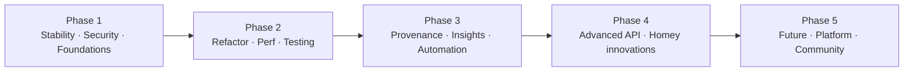

# 15 — Prioritised Roadmap

> Orchestrator synthesis across all deliverables, normalised to one priority model and reconciled with the
> existing `ROADMAP.md` + `docs/handover/sprints-50-58-spec.md`. Backlog IDs reference
> [14-engineering-backlog.md](14-engineering-backlog.md); phasing matches [16-implementation-plan.md](16-implementation-plan.md).
> Prioritisation ≈ (Impact × User value × Innovation) ÷ Effort, tie-broken by risk reduction.

## Guiding sequence
Stability & safety **before** refactor **before** features. The `OctopusMeterDevice` decomposition (BL-07) is the
pivot: it is the dependency for most Phase-3+ features, so it is scheduled early — but only *after* budget hardening
and characterization tests, and with zero user-visible change. The open **IOG v1.0.20 field-verification** (R-007)
runs in parallel as an operational gate and is not a code milestone.

## Phase 1 — Critical stability, security & foundations  (completes S51)
**Theme:** protect the shared Kraken budget, close privacy/repair gaps, no new user-facing scope.
| Item | Why now | Effort | Priority |
|---|---|---|---|
| BL-01 Reserved-core budget + fairness + 1-hour system test | R-001 is the highest operational exposure | M | P1 |
| BL-02 Startup jitter | Stops boot stampede throttling live data | S | P1 |
| BL-03 REST coalescer | Removes duplicate consumption/rates/standing reads | M | P1 |
| BL-10 Opaque diagnostic/state keys | Top privacy finding (R-010) | M | P1 |
| BL-11 Account-wide credential propagation | Stale sibling creds after repair (R-009) | M | P1 |
| BL-14 Protected publish environment + PAT rotation | Reconciled security control (R-011) | S | P2 |
| BL-04/05 points + carbon caches; BL-12 encode; BL-29 README/lint | Cheap wins | S | P2–P3 |
**Exit criteria:** system budget test green; no account/meter IDs in persisted data; repair re-keys siblings; CI (audit/lint/test/validate/CodeQL) green. **Gate:** IOG Build-20 field confirmation requested in parallel.

## Phase 2 — Refactoring, performance & testing  (S52)
**Theme:** create safe seams; zero user-visible change.
| Item | Why now | Effort | Priority |
|---|---|---|---|
| BL-06 Characterization/golden tests | Must precede any movement (R-003) | M | P1 |
| BL-07 Decompose `OctopusMeterDevice` into services | Unblocks all later features (R-002) | XL | P1 |
| BL-08 Single cumulative writer + generation/Abort guard | Kills stale-write race (R-004) | M | P1 |
| BL-09 Central tz/mask/redaction utils + typed `OctopusApp` | Removes duplication (03/18) | S | P2 |
| BL-30 API-client hardening (JWT exp, contract test, re-introspection) | De-risks versionless API (R-005) | S | P2 |
| BL-13 Redaction parity | Folds into central redaction | S | P3 |
**Exit criteria:** device is a thin façade over tested services; all prior tests pass + new service tests; no capability-ID/Flow-edge change.

## Phase 3 — Provenance, insights & automation  (S53–S54, parts of S55/S56)
**Theme:** honest per-source freshness, settled insights, and the first high-value automations.
| Item | Why now | Effort | Priority |
|---|---|---|---|
| BL-15 Per-source freshness + stale-aware tokens/badges | Protects the F1 trust differentiator (R-017) | M | P1 |
| BL-16 Accessibility pass | Inclusive UX; low risk | M | P2 |
| BL-17 `usage_today` local-day vs rolling-24h | Correctness/UX (BB-08) | M | P2 |
| BL-18 Settled-consumption insights + budget Flows | Headline value; uses REST `group_by` | L | P1 |
| BL-20 Saving-Session "soon" de-dup; BL-21 Power-ups automation | Fixes noise; adds automation | S–M | P2 |
**Exit criteria:** every widget/Flow token exposes source + age; settled insights match a known bill window; no duplicate "soon" triggers.

## Phase 4 — Advanced features & Homey innovations  (S55–S58 + platform)
**Theme:** differentiators that close the gap vs Home Assistant/Tibber, within budget discipline.
| Item | Why now | Effort | Priority |
|---|---|---|---|
| BL-19 Tariff comparison 2.0 (eligibility/confidence, no "best") | Corrects a misleading feature (R-015) | L | P1 |
| BL-22 Target-rate stateless service (trigger+condition) | Top requested automation; no new polling | M | P1 |
| BL-23 Dispatch read-surface deepening | Parity with HA read features | M | P2 |
| BL-25 Carbon/cost & export/Flux optimiser | Power-user value | L | P2 |
| BL-26/27 New widgets & Flow cards (REST-default) | Product surface growth | M–L | P2 |
**Exit criteria:** comparison never claims "best" and shows confidence; target-rate cards recompute on `rates_published`; new live surfaces fit F0.

## Phase 5 — Future vision, platform & community
**Theme:** bolder bets and ecosystem.
| Item | Why now | Effort | Priority |
|---|---|---|---|
| BL-24 Dispatch **control** (consent-gated, reference-verified) | Headline differentiator; highest API risk | L | P2 |
| BL-28 Internationalisation | Broaden reach | M | P3 |
| Innovation catalogue picks (see [19](19-future-ideas-innovation-catalogue.md)) | Multi-account households, dashboards, greenness automations, reporting | varies | P2–P3 |
**Exit criteria:** any write-mutation feature is opt-in, reference-client-verified, reversible, and never inferred as settled billing.

## Divergences from the existing plan (explicit)
- **Pulls BL-10 (opaque keys) and BL-11 (credential propagation) into Phase 1** — the existing spec placed some of this in S51g/S53; the blueprint treats them as security/privacy P1 because they touch persisted user data.
- **Elevates the budget/system test (BL-01) to the first milestone** — R-001 is the highest-exposure operational risk and gates safe feature growth.
- **Keeps Sprint 48 (live gas) dropped** — consistent with `sprints-42-48-spec.md` (R-016); research-only.
- **Reframes dispatch work** as read-first with control deferred to Phase 5 behind consent — reconciling the product/architecture disagreement.
- Everything else **aligns with** S51→S58; this roadmap sequences and de-risks it rather than replacing it.

## One-line summary
Finish S51 hardening → safely decompose the god-object → ship honest per-source provenance and settled insights →
then the differentiating automations (target-rate, comparison 2.0, dispatch intelligence) — protecting the shared
Kraken budget and the estimate/settled trust discipline at every step.
