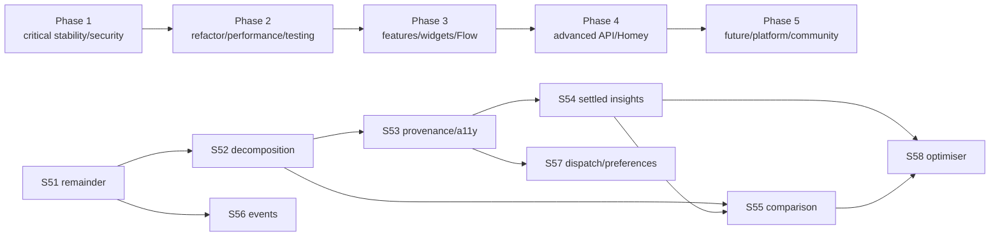

# 16 — Blueprint Implementation Plan

**Plan horizon:** post-v1.0.20  
**Principle:** stabilise and separate authority boundaries before adding features

## Planning invariants

1. Preserve every capability, driver, widget and Flow ID unless a separately
   documented migration is approved
   (`docs/handover/sprints-50-58-spec.md` REQ-001).
2. REST remains authoritative for meter identity, published rates, consumption and
   billing; GraphQL remains operational/enrichment and fails closed.
3. Preserve F0 shared Kraken budgeting and F1 provenance.
4. Never present planned, telemetry or estimated values as settled/finalised.
5. Keep diagnostics identifier-free and secrets out of source/logs/fixtures.
6. Keep one sprint/change set independently reviewable.
7. The open IOG field-verification gate remains tracked and unchanged.

## Delivery dependency map

## Phase 1 — Critical bugs, security and architectural foundations

**Goal:** close known account-wide reliability/security gaps before broad change.

### 1.1 Close S51 Kraken/request hardening

Maps directly to S51b-h:

- bounded/reserved core admission;
- startup jitter across account pollers;
- identifier-free budget counters by priority/feature;
- short-TTL REST request coalescing;
- account-level Octoplus points cache;
- account-wide repair credential propagation;
- one-hour two-EV ≤90-call simulation.

**Additions from this blueprint:**

- classify official GraphQL `errors[].extensions.errorCode`, including point and
  field-specific rate limits;
- document the conservative 90-call governor as an empirical safety ceiling beside
  official complexity/points quotas;
- protect the publish workflow with a reviewed environment and PAT rotation
  runbook;
- migrate persisted account-keyed diagnostics toward opaque correlation keys.

**Exit gates:**

- no sibling device retains an old API key after successful repair;
- no identifier appears in persisted diagnostics;
- core cannot permanently starve live/best;
- simulated account remains within the configured ceiling;
- budget skips preserve last-known freshness and do not raise connection alarms.

### 1.2 Operational gate: IOG field verification

Keep the v1.0.20 verification item exactly as described in `HANDOVER.md`: promote
Build 20 to Test, obtain one affected-account diagnostic/confirmation, and only
then close the incident. This is an operational gate, not a reason to alter the
blueprint or silently change tariff logic.

⚠ **Cross-discipline note:** product may want to announce the IOG incident as
resolved after code/tests. Architecture and security require field evidence because
the contract is account-dependent.

## Phase 2 — Refactoring, performance and testing

**Goal:** create safe seams for S53-S58 with zero user-visible change.

### 2.1 S52 decomposition

Map to S52a-e, with this target sequence:

1. add characterization tests for refresh order, capability writes, cumulative
   cursor, repair rollback, IOG recovery and timer cleanup;
2. introduce typed `OctopusApp`, clock, store, capability and notification ports;
3. centralise timezone, masking/redaction and diagnostic correlation;
4. extract `HealthProvenanceService` and `DeviceScheduler`;
5. extract `TariffService` and `PriceService`;
6. extract `ConsumptionService` with one cursor/store writer;
7. extract `ReportingService` and a thin `PlanningFacade`;
8. make `OctopusMeterDevice` a lifecycle/delegation façade;
9. replace the 90-second lock reset with generation/cancellation safety.

**Exit gates:**

- no manifest/version/ID change;
- before/after characterization outputs match;
- no duplicate cumulative writer;
- no integration service directly mutates unrelated capability domains;
- all account/network access passes typed ports/caches.

### 2.2 API/client hardening

- add a typed GraphQL operation-error model;
- enforce exact production GraphQL origins;
- add response/node bounds;
- use token expiry claim with safety skew if available;
- centralise unsupported-field backoff;
- audit REST `page_size` and use bounded time windows/grouping.

### 2.3 Performance baseline

Capture:

- REST/GraphQL requests per account/hour by feature;
- refresh duration percentiles;
- cache hit/miss and coalesced request counts;
- stale duration by data source;
- widget API response time;
- memory footprint of large consumption pages.

Metrics must be aggregate and identifier-free.

## Phase 3 — Features, widgets, Flow and automation

**Goal:** deliver mainstream value on stable service boundaries.

### 3.1 S53 per-source provenance and accessibility

Maps directly to S53:

- per-domain price/consumption/balance/carbon/live/dispatch/billing readings;
- stale-aware Flow conditions/tokens;
- consistent widget source badges;
- settings save/error feedback;
- non-colour-only chart summaries and keyboard/screen-reader support;
- “today” versus “rolling 24h” terminology audit;
- capability options/Insights audit.

Prefer widget/token presentation over adding many permanent freshness capabilities.

### 3.2 S54 settled-consumption insights and budget automation

Maps directly to S54:

- REST `group_by` day/week/month;
- settlement-through timestamp;
- usage/cost history and peak share;
- monthly budget and run-rate settings;
- crossing-based over-budget/run-rate trigger;
- insights widget/drill-down.

Additional acceptance:

- live demand never enters billing totals;
- Homey cumulative Energy remains monotonic;
- projections always state estimate/confidence.

### 3.3 S56 Saving Sessions / Power Ups

Maps directly to S56:

- announced/soon/active/joined states where proven;
- event widget/timeline;
- reminders with quiet hours, lead time and dedupe;
- pending versus finalised reward language.

Auto-join remains omitted unless a documented mutation exists and explicit consent,
rollback and replay protection are designed.

### 3.4 Flow/Advanced Flow usability

Instead of expanding the already large card catalogue indiscriminately:

- publish versioned Advanced Flow recipes;
- add plan-token round trip only where it removes fragile user logic;
- standardise card hints, formatted titles, source/confidence tokens and failure
  semantics;
- document multi-meter selection.

## Phase 4 — Advanced API and Homey innovations

**Goal:** add power-user features without weakening source authority.

### 4.1 S55 tariff comparison 2.0

Maps to S55:

- one cached product catalogue;
- Agile/Go/Tracker/gas/Cosy/export pairing;
- actual consumption-shape simulation including standing charges;
- payment-method/eligibility/restriction checks;
- confidence and “not evaluated” reasons;
- output named “estimate,” never “best tariff”;
- no auto-switch.

### 4.2 S57 planned dispatch and IOG preferences

Maps to S57:

- plan-starts-within condition;
- stable plan token;
- standalone estimated-effective-rate condition;
- read-only target-SoC/ready-by only after live introspection and fixtures;
- operation-specific budget cost and unsupported-field backoff.

Any write remains a later, separately threat-modelled feature.

### 4.3 S58 Cosy/E7, import/export and carbon optimiser

Maps to S58:

- use published dated REST rows, never marketing timetable constants;
- paired import/export recommendation;
- price-carbon weighting;
- greenest-window widget;
- live Flux eligibility;
- recommendation only.

### 4.4 Newer Homey Energy control capabilities

Evaluate `target_power`/`target_power_mode` only if a future driver represents a
real controllable EV charger/battery with feedback. Do not attach them to the
current account/meter proxy. This item is **not** part of S58 delivery.

## Phase 5 — Future, platform and community

### 5.1 Community and field-feedback loop

- structured privacy-safe diagnostics;
- build/version and tariff-shape capture without identifiers;
- release/Test confirmation checklist;
- community recipe gallery;
- deprecation/announcement watch.

### 5.2 Platform maintenance

- SHA-pinned action runtime upgrades in dedicated PRs;
- periodic Node/Homey SDK compatibility review;
- Homey widget API/accessibility refresh;
- dependency SBOM/provenance if supported;
- secret scanning and PAT rotation exercises.

### 5.3 Future API research

- official `rateLimitInfo` suitability for domestic accounts;
- read-only flex preference contracts;
- greenness/account accomplishment metadata;
- settlement/bill APIs only if authority and privacy are clear;
- webhooks/subscriptions only if officially supported and materially reduce
  polling.

### 5.4 Explicit non-goals

- shippable estimated live gas;
- automatic tariff switching;
- silent dispatch/charging/auto-join writes;
- planned dispatch presented as settled price;
- Matter/Thread integration without a concrete hardware product;
- building on time-limited Greener Nights;
- hard-coded Cosy/Flux/Go schedules.

## Reconciliation with S50-S58

| Existing item | Blueprint disposition |
|---|---|
| S50 stability | **Completed; retained** |
| S51 token single-flight | **Completed; retained** |
| S51 remainder | **Phase 1, expanded with GraphQL error/CI secret controls** |
| S52 decomposition | **Phase 2, retained and made more explicit** |
| S53 provenance/a11y | **Phase 3, retained** |
| S54 settled insights | **Phase 3, retained** |
| S55 comparison 2.0 | **Phase 4, retained with eligibility/payment-method detail** |
| S56 event automation | **Phase 3, retained; no undocumented auto-join** |
| S57 dispatch/preferences | **Phase 4, retained; read-only first** |
| S58 optimiser | **Phase 4, retained; recommendation-only** |

No S50-S58 item is superseded wholesale. The blueprint **extends** S51 security and
observability, **tightens** S52 concurrency/ports, and **constrains** newer Homey
control capabilities to a future real actuator model.

## Programme-level definition of done

- functional and provenance acceptance criteria documented before implementation;
- targeted tests plus full existing lint/test/audit/validate gates;
- no new secrets/identifiers in logs, diagnostics or fixtures;
- request budget and source freshness measured;
- Homey Compose/generated manifest parity maintained;
- field verification for account-dependent GraphQL changes;
- docs, risk register and handover updated per sprint;
- independent code/security review for budget, credential, mutation and release
  pipeline changes.
